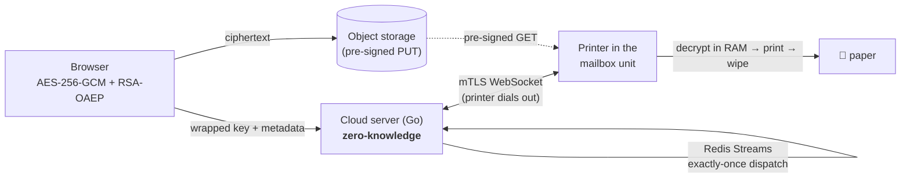

# Automail

> ### 👉 Short on time? Start at **[`00-PROJECT-SUMMARIES/`](00-PROJECT-SUMMARIES/)**
> Four one-page summaries — security, testing, Kubernetes, full-stack — about a minute each, every
> claim linked to the code or the measured run behind it. That folder is the fastest way to judge
> this project.

**An end-to-end-encrypted automated mail system.** A sender uploads a PDF; it is encrypted **in the
browser** before it leaves; a cloud server routes ciphertext it has no ability to decrypt; and a
printer inside a physical mailbox unit unwraps the key in RAM, prints the document, and wipes it
before reporting delivery.

The interesting constraint is the one the whole design is built around: **the server operator
cannot read the mail.** Not "does not" — *cannot*. A full database dump plus every object in blob
storage yields ciphertext and metadata.



It is a personal/portfolio project, built to production discipline: written specs before code,
per-phase acceptance criteria, security invariants enforced as build-failing tests, and every
performance number traceable to a committed run.

---

## Skim by skill

Four one-page summaries, each linking to the evidence behind every claim:

| Page | What it covers |
|---|---|
| [Security & cryptography](00-PROJECT-SUMMARIES/security.md) | Hybrid E2EE, the zero-knowledge boundary, and invariants that **fail the build** rather than living in a comment |
| [Testing & quality](00-PROJECT-SUMMARIES/testing.md) | 127 Go tests, fuzzing, contract tests across two languages, chaos, load gates, browser E2E |
| [Kubernetes & distributed systems](00-PROJECT-SUMMARIES/kubernetes.md) | Rolling updates with zero dropped requests, autoscaling 2→7 pods, exactly-once dispatch across nodes |
| [Full-stack portal](00-PROJECT-SUMMARIES/portal.md) | Next.js/TypeScript UI doing real cryptography in the browser, live status over SSE, JWT + RBAC |

Start at [00-PROJECT-SUMMARIES/](00-PROJECT-SUMMARIES/) for the index.

## Stack

**Go** (cloud server, printer microservice) · **TypeScript / React / Next.js** (sender portal) ·
**PostgreSQL** · **Redis** (Streams + pub/sub) · **MinIO** (S3-compatible) · **Docker Compose** and
**Kubernetes** (k3d/k3s, Kustomize, HPA) · **Traefik** · **mTLS** on every internal hop ·
**CUPS/IPP** for physical printing · **k6**, **Playwright**, **testcontainers**, **GitHub Actions**

## Status

| | |
|---|---|
| Core product | Complete — phases 0–10, including **real paper** out of a Canon imageCLASS MF240 over driverless IPP-over-USB |
| Hardening | Complete — a 12-part testing programme (unit → integration → E2E → chaos → load → release gates) |
| Kubernetes | Complete — stateless tier on a 4-node cluster, [measured](infra/k8s/RESULTS.md); one open item (live status through the Traefik edge) |

## Running it

```sh
cp .env.example .env                  # then fill in the values it names
./infra/certs/gen.sh                  # internal mTLS PKI (cloud <-> printer)
./infra/certs/gen-jwt-keys.sh         # JWT RS256 signing keypair
PRINTER_KEY_PASSPHRASE='...' ./infra/certs/gen-printer-keys.sh
./infra/certs/gen-edge-certs.sh       # browser-facing edge TLS
docker compose up -d --build
```

Full first-deploy walkthrough: [docs/deploy-checklist.md](docs/deploy-checklist.md).
`make help` lists every gate (`make ci`, `make test-e2e-full`, `make chaos`, `make load`, `make scan`).

## Repository map

| Path | What lives there |
|---|---|
| [`00-PROJECT-SUMMARIES/`](00-PROJECT-SUMMARIES/) | 👉 **Start here** — the one-page summaries linked above |
| [`plans/`](plans/) | The specification — 16 design docs, written **before** the code. `plans/10` carries each phase's acceptance criterion |
| [`services/cloud/`](services/cloud/) | Go cloud server: API, dispatch, printer-link hub, auth |
| [`services/printer/`](services/printer/) | Go printer microservice — the only place plaintext ever exists |
| [`services/portal/`](services/portal/) | Next.js sender portal (browser-side encryption) |
| [`infra/k8s/`](infra/k8s/) | Kubernetes manifests + [measured results](infra/k8s/RESULTS.md) |
| [`docs/study/`](docs/study/) | 28 deep explainers — the *why* behind each decision |
| [`00-PROJECT-SUMMARIES/`](00-PROJECT-SUMMARIES/) | The one-page summaries linked above |

## An honest note on the numbers

Every performance and reliability figure in this repo was produced by a scripted run that wrote it
into a tracked file at the moment it ran — not typed in afterwards. Those runs happened on a single
developer machine, and they are labelled as such everywhere they appear. They are regression
tripwires, not production SLAs, and the "what this does not prove" sections are part of the
deliverable rather than an afterthought.
