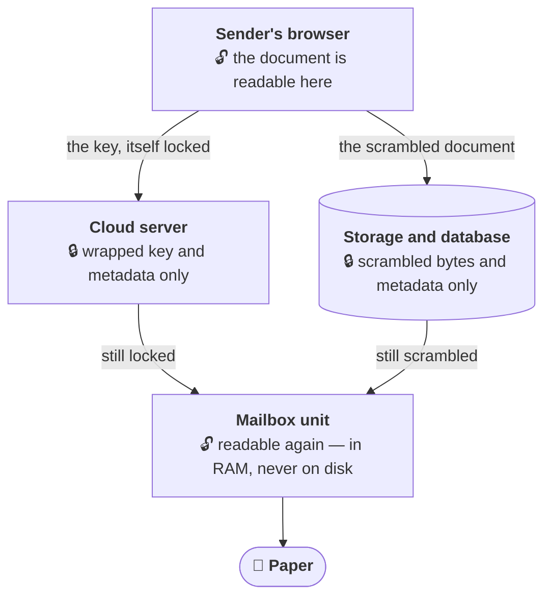
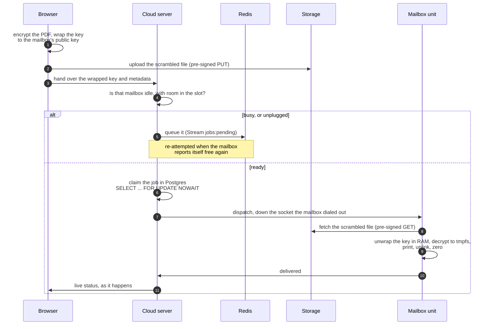

# Automail

> ### 👉 Short on time? Start at **[`00-PROJECT-SUMMARIES/`](00-PROJECT-SUMMARIES/)**
> Four one-page summaries — security, testing, Kubernetes, full-stack — about a minute each, every
> claim linked to the code or the measured run behind it. That folder is the fastest way to judge
> this project.

**Automail delivers real mail — the kind that comes out on paper — and nobody along the way can
read it.**

You open a web page, pick who you're writing to, choose a PDF and hit send. A printer sitting
inside that person's mailbox prints it, and the page is waiting for them when they open the box.
Your document is scrambled in your browser before it ever leaves your computer, and it is only
unscrambled inside the mailbox itself.

That is the constraint the whole system is built around: **the operator cannot read the mail.** Not
"does not" — *cannot*. Steal the entire database and every stored file and you get scrambled bytes
plus metadata — which mailbox, when, how big — and no way to turn any of it back into a document.

## The pieces



🔓 means the document exists in readable form there. 🔒 means it does not, and nothing stored at
that step can make it readable. Only the two ends are unlocked — and the mailbox end is the only
thing in the world holding the key that opens it.

<details>
<summary><b>Sender's browser</b> — where the encryption actually happens</summary>

A Next.js/TypeScript portal. The PDF is encrypted with **AES-256-GCM** using the browser's own Web
Crypto, and that one-use key is then wrapped to the destination mailbox's **RSA-4096** public key
(OAEP). The scrambled file goes **straight to object storage** on a pre-signed URL — it never passes
through the application server at all. → [`services/portal/`](services/portal/),
[browser E2EE](docs/study/18-web-crypto-e2ee-portal.md),
[hybrid encryption](docs/study/16-hybrid-encryption.md)
</details>

<details>
<summary><b>Cloud server</b> — the part that is deliberately kept ignorant</summary>

Go, running as N interchangeable nodes behind a load balancer. It stores the wrapped key **verbatim**
and forwards it to exactly one place: the mailbox that can open it. It never holds the private key,
never streams the document's bytes, and never logs the wrapped key. Those aren't promises in a
comment — an AST scanner walks the whole tree in CI on every push and **fails the build** if any of
them is violated, with a sibling test that plants a violation to prove the scanner still works. →
[`services/cloud/`](services/cloud/), [security summary](00-PROJECT-SUMMARIES/security.md)
</details>

<details>
<summary><b>Storage and database</b> — what a full breach would actually yield</summary>

MinIO (S3-compatible) holds the scrambled documents; PostgreSQL holds job rows and an
append-only audit log that a database trigger refuses to let anyone `UPDATE` or `DELETE`. Personal
details are themselves encrypted in the columns with pgcrypto. → [audit
immutability](docs/study/06-postgres-audit-immutability.md), [PII
encryption](docs/study/07-pgcrypto-pii-encryption.md)
</details>

<details>
<summary><b>Mailbox unit</b> — the only place plaintext ever exists</summary>

A Go service inside the physical unit, holding the private key. It unwraps the document key **in
RAM**, decrypts into `/dev/shm` (tmpfs — a filesystem that only ever lives in memory), prints via
CUPS/IPP, and **unlinks the file before** it reports the job delivered, then zeroes the buffers. It
also dials *out* to the cloud over a mutually-authenticated WebSocket, so a mailbox never needs an
inbound hole in anyone's firewall. → [`services/printer/`](services/printer/), [dispatch
fan-in](docs/study/11-dispatch-fan-in-printer-link.md)
</details>

<details>
<summary><b>Paper</b> — yes, really</summary>

A Canon imageCLASS MF240 over driverless IPP-over-USB. Phase 10 is closed against physical paper,
not a simulator, and `/dev/shm` was checked clean afterwards on the real hardware. → [status
log](GOALS.md), [CUPS host setup](docs/cups-host-setup.md)
</details>

## What happens when you send one



**Two mechanisms guard the queued path, deliberately not one.** The Redis Stream's consumer group decides
*which node* picks up a queued job and keeps the entry alive if that node dies mid-attempt — that is
*at-least-once* delivery, not exactly-once. What guarantees a job is never printed twice is the
Postgres row lock, which also covers the straight-through path that never touches the queue at all.

## Questions you're probably about to ask

<details>
<summary>So the operator <i>could</i> read it, if they really wanted to?</summary>

No — and that is a design property, not a policy. The private key that opens a document exists only
inside the mailbox unit. The server has never had it and has nowhere to get it. The honest limit of
the claim: the operator does learn **metadata** — which sender wrote to which mailbox, when, and how
large the file was. Traffic analysis is not defended against, and the summary
[says so](00-PROJECT-SUMMARIES/security.md) rather than glossing it.
</details>

<details>
<summary>What happens if the mailbox is unplugged when I hit send?</summary>

The job is queued rather than lost or bounced, and re-attempted the moment that mailbox reports
itself free again — see the "busy, or unplugged" branch above. If the cloud node handling it dies
mid-attempt, the queue entry survives and another node reclaims it, but only once it is *provably*
abandoned. → [Redis Streams and consumer
groups](docs/study/14-redis-streams-consumer-groups.md)
</details>

<details>
<summary>How do I know the security claims are true and not just prose?</summary>

Because most of them are tests that **fail the build**, not sentences. `TestInvariant_ZeroKnowledgeCloud`
walks the source for any decryption call or logged key; `TestInvariant_PlaintextWritesTargetTmpfsOnly`
pins plaintext to memory-backed storage; a certless client is *refused* by the internal listener.
And because the encrypting code is TypeScript while the decrypting code is Go, a committed contract
test makes the browser emit a real vector and the Go printer decrypt it byte-for-byte — plus a
one-bit-flip case that must be rejected outright. → [testing
summary](00-PROJECT-SUMMARIES/testing.md)
</details>

<details>
<summary>Why does a mailbox need Kubernetes?</summary>

The mailbox doesn't. The cloud tier does, and that tier is the interesting distributed-systems
problem: N interchangeable nodes, a printer socket pinned to exactly one of them, rolling updates
that must not drop a request or sever a live status stream. It runs on a 4-node cluster with the
numbers written down by the run that produced them. → [Kubernetes
summary](00-PROJECT-SUMMARIES/kubernetes.md), [measured results](infra/k8s/RESULTS.md)
</details>

<details>
<summary>Is this a product?</summary>

No — a personal/portfolio project, built to production discipline: written specs before code,
per-phase acceptance criteria, security invariants enforced as build-failing tests, and every
performance number traceable to a committed run on a named machine.
</details>

---

## Skim by skill

Four one-page summaries, each linking to the evidence behind every claim:

| Page | What it covers |
|---|---|
| [Security & cryptography](00-PROJECT-SUMMARIES/security.md) | Hybrid E2EE, the zero-knowledge boundary, and invariants that **fail the build** rather than living in a comment |
| [Testing & quality](00-PROJECT-SUMMARIES/testing.md) | 127 Go tests, fuzzing, contract tests across two languages, chaos, load gates, browser E2E |
| [Kubernetes & distributed systems](00-PROJECT-SUMMARIES/kubernetes.md) | Rolling updates with zero dropped requests, autoscaling 2→7 pods, no job dispatched twice across nodes |
| [Full-stack portal](00-PROJECT-SUMMARIES/portal.md) | Next.js/TypeScript UI doing real cryptography in the browser, live status over SSE, JWT + RBAC |

Start at [00-PROJECT-SUMMARIES/](00-PROJECT-SUMMARIES/) for the index.

## Stack

**Go** (cloud server, printer microservice) · **TypeScript / React / Next.js** (sender portal) ·
**PostgreSQL** · **Redis** (Streams + pub/sub) · **MinIO** (S3-compatible) · **Docker Compose** and
**Kubernetes** (k3d/k3s, Kustomize, HPA) · **Traefik** · **mTLS** on every internal hop ·
**CUPS/IPP** for physical printing · **k6**, **Playwright**, **testcontainers**, **GitHub Actions**

## Status

| | |
|---|---|
| Core product | Complete — phases 0–10, including **real paper** out of a Canon imageCLASS MF240 over driverless IPP-over-USB |
| Hardening | Complete — a 12-part testing programme (unit → integration → E2E → chaos → load → release gates) |
| Kubernetes | Complete — stateless tier on a 4-node cluster, [measured](infra/k8s/RESULTS.md); one open item (live status through the Traefik edge) |

## Running it

```sh
cp .env.example .env                  # then fill in the values it names
./infra/certs/gen.sh                  # internal mTLS PKI (cloud <-> printer)
./infra/certs/gen-jwt-keys.sh         # JWT RS256 signing keypair
PRINTER_KEY_PASSPHRASE='...' ./infra/certs/gen-printer-keys.sh
./infra/certs/gen-edge-certs.sh       # browser-facing edge TLS
docker compose up -d --build
```

Full first-deploy walkthrough: [docs/deploy-checklist.md](docs/deploy-checklist.md).
`make help` lists every gate (`make ci`, `make test-e2e-full`, `make chaos`, `make load`, `make scan`).

## Repository map

| Path | What lives there |
|---|---|
| [`00-PROJECT-SUMMARIES/`](00-PROJECT-SUMMARIES/) | 👉 **Start here** — the one-page summaries linked above |
| [`plans/`](plans/) | The specification — 16 design docs, written **before** the code. `plans/10` carries each phase's acceptance criterion |
| [`services/cloud/`](services/cloud/) | Go cloud server: API, dispatch, printer-link hub, auth |
| [`services/printer/`](services/printer/) | Go printer microservice — the only place plaintext ever exists |
| [`services/portal/`](services/portal/) | Next.js sender portal (browser-side encryption) |
| [`docker-compose.yml`](docker-compose.yml) | The deployment. `docker compose up -d --build` needs no arguments |
| [`infra/compose/`](infra/compose/) | Overlays on top of it — demo, test profiles, load harness. [What each one is for](infra/compose/README.md) |
| [`infra/k8s/`](infra/k8s/) | Kubernetes manifests + [measured results](infra/k8s/RESULTS.md) |
| [`docs/study/`](docs/study/) | 31 deep explainers — the *why* behind each decision |

## An honest note on the numbers

Every performance and reliability figure in this repo was produced by a scripted run that wrote it
into a tracked file at the moment it ran — not typed in afterwards. Those runs happened on a single
developer machine, and they are labelled as such everywhere they appear. They are regression
tripwires, not production SLAs, and the "what this does not prove" sections are part of the
deliverable rather than an afterthought.
