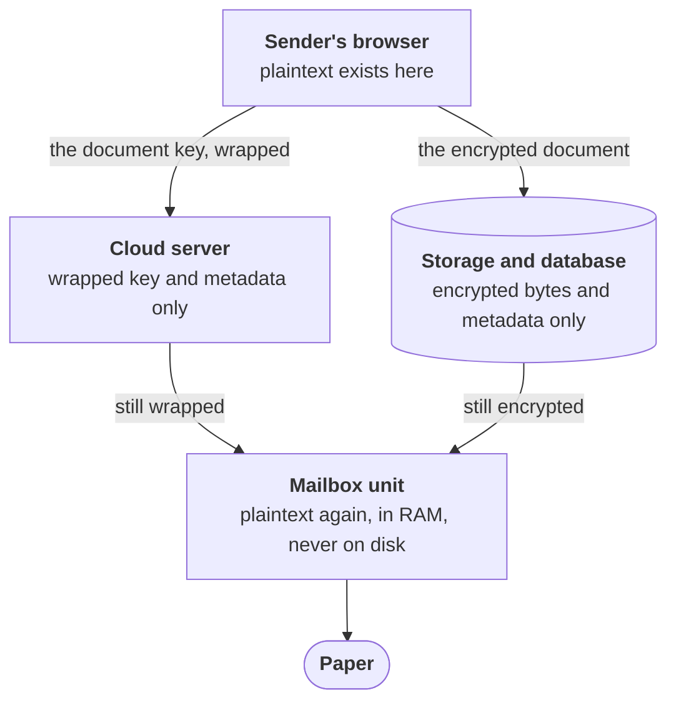
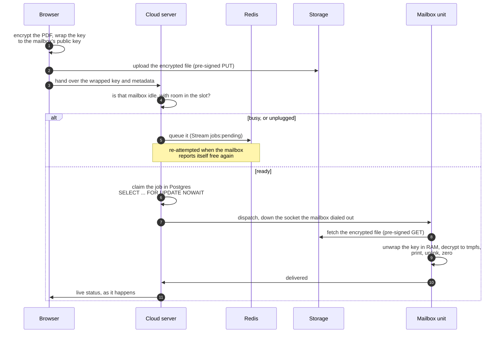

# Automail

> **Short on time?** Start at [`00-PROJECT-SUMMARIES/`](00-PROJECT-SUMMARIES/). Four one-page
> summaries (security, testing, Kubernetes, full-stack), about a minute each, with every claim
> linked to the code or the measured run behind it.

**Automail delivers physical mail, encrypted end to end into the recipient's mailbox.**

You open a web page, pick who you're writing to, choose a PDF and hit send. A printer sitting inside
that person's mailbox prints it, and the page is waiting for them when they open the box. Your
document is encrypted in your browser before it leaves your computer, and it is only decrypted
inside the mailbox itself.

## The problem it solves

Getting a document onto paper in someone else's hands means handing the file to whoever owns the
printer, and whatever prints your document can read it. Automail moves the printer to the far end of
the trip and keeps the only decryption key there.

So the constraint the whole system is built around is that **the operator cannot read the mail**,
and that is a property of the design rather than a line in a privacy policy. Steal the entire
database and every stored file and you get encrypted bytes plus metadata (which mailbox, when, how
big), with no way to turn any of it back into a document.

It is a portfolio project rather than a product, built to production discipline: written specs
before code, per-phase acceptance criteria, security invariants enforced as tests that fail the
build, and every performance number traceable to a committed run on a named machine.

## The pieces



Plaintext exists at exactly two points: the sender's browser and the mailbox unit. Nothing stored at
any step in between can produce it, and the mailbox holds the only copy of the key that could.

<details>
<summary><b>Sender's browser</b>: where the encryption happens</summary>

A Next.js/TypeScript portal. The PDF is encrypted with AES-256-GCM using the browser's own Web
Crypto, and that one-use key is then wrapped to the destination mailbox's RSA-4096 public key
(OAEP). The encrypted file goes straight to object storage on a pre-signed URL, so it never passes
through the application server at all. See [`services/portal/`](services/portal/),
[browser E2EE](docs/study/18-web-crypto-e2ee-portal.md), and
[hybrid encryption](docs/study/16-hybrid-encryption.md).
</details>

<details>
<summary><b>Cloud server</b>: what it holds, and what it is prevented from holding</summary>

Go, running as N interchangeable nodes behind a load balancer. It stores the wrapped key verbatim
and forwards it to exactly one place, the mailbox that can open it. It never holds the private key,
never streams the document's bytes, and never logs the wrapped key. Those three rules are enforced
rather than documented: an AST scanner walks the whole tree in CI on every push and fails the build
if any of them is violated, with a sibling test that plants a violation to prove the scanner still
works. See [`services/cloud/`](services/cloud/) and the
[security summary](00-PROJECT-SUMMARIES/security.md).
</details>

<details>
<summary><b>Storage and database</b>: what a full breach would yield</summary>

MinIO (S3-compatible) holds the encrypted documents. PostgreSQL holds job rows and an append-only
audit log that a database trigger refuses to let anyone `UPDATE` or `DELETE`. Personal details are
themselves encrypted in the columns with pgcrypto. See [audit
immutability](docs/study/06-postgres-audit-immutability.md) and [PII
encryption](docs/study/07-pgcrypto-pii-encryption.md).
</details>

<details>
<summary><b>Mailbox unit</b>: the only place plaintext exists</summary>

A Go service inside the physical unit, holding the private key. It unwraps the document key in RAM,
decrypts into `/dev/shm` (tmpfs, a filesystem that only ever lives in memory), prints via CUPS/IPP,
unlinks the file *before* it reports the job delivered, then zeroes the buffers. It also dials *out*
to the cloud over a mutually-authenticated WebSocket, so a mailbox never needs an inbound hole in
anyone's firewall. See [`services/printer/`](services/printer/) and [dispatch
fan-in](docs/study/11-dispatch-fan-in-printer-link.md).
</details>

<details>
<summary><b>Paper</b>: the physical end of the chain</summary>

A Canon imageCLASS MF240 over driverless IPP-over-USB. Phase 10 is closed against physical paper,
not a simulator, and `/dev/shm` was checked clean afterwards on the real hardware. See the [status
log](GOALS.md) and [CUPS host setup](docs/cups-host-setup.md).
</details>

## What happens when you send one



Two separate mechanisms guard the queued path. The Redis Stream's consumer group decides *which
node* picks up a queued job and keeps the entry alive if that node dies mid-attempt, which gives
at-least-once delivery rather than exactly-once. What guarantees a job is never printed twice is the
Postgres row lock, which also covers the straight-through path that never touches the queue at all.

## FAQ

<details>
<summary>So the operator <i>could</i> read it, if they really wanted to?</summary>

No, and that is a design property rather than a policy. The private key that opens a document exists
only inside the mailbox unit. The server has never had it and has nowhere to get it. The limit of
the claim: the operator does learn metadata, meaning which sender wrote to which mailbox, when, and
how large the file was. Traffic analysis is not defended against, and the summary
[says so](00-PROJECT-SUMMARIES/security.md) rather than glossing it.
</details>

<details>
<summary>What happens if the mailbox is unplugged when I hit send?</summary>

The job is queued rather than lost or bounced, and re-attempted the moment that mailbox reports
itself free again. That's the "busy, or unplugged" branch above. If the cloud node handling it dies
mid-attempt, the queue entry survives and another node reclaims it, but only once it is *provably*
abandoned. See [Redis Streams and consumer
groups](docs/study/14-redis-streams-consumer-groups.md).
</details>

<details>
<summary>How do I know the security claims are true and not just prose?</summary>

Most of them are tests that fail the build. `TestInvariant_ZeroKnowledgeCloud` walks the source for
any decryption call or logged key. `TestInvariant_PlaintextWritesTargetTmpfsOnly` pins plaintext to
memory-backed storage. A certless client is *refused* by the internal listener. And because the
encrypting code is TypeScript while the decrypting code is Go, a committed contract test makes the
browser emit a real vector and the Go printer decrypt it byte-for-byte, plus a one-bit-flip case
that must be rejected outright. See the [testing summary](00-PROJECT-SUMMARIES/testing.md).
</details>

<details>
<summary>Why does a mailbox need Kubernetes?</summary>

The mailbox doesn't. The cloud tier does, and that tier is the interesting distributed-systems
problem: N interchangeable nodes, a printer socket pinned to exactly one of them, rolling updates
that must not drop a request or sever a live status stream. It runs on a 4-node cluster with the
numbers written down by the run that produced them. See the [Kubernetes
summary](00-PROJECT-SUMMARIES/kubernetes.md) and the [measured results](infra/k8s/RESULTS.md).
</details>

---

## One-page summaries

Four of them, each linking to the evidence behind every claim:

| Page | What it covers |
|---|---|
| [Security & cryptography](00-PROJECT-SUMMARIES/security.md) | Hybrid E2EE, the zero-knowledge boundary, and invariants that fail the build rather than living in a comment |
| [Testing & quality](00-PROJECT-SUMMARIES/testing.md) | 127 Go tests, fuzzing, contract tests across two languages, chaos, load gates, browser E2E |
| [Kubernetes & distributed systems](00-PROJECT-SUMMARIES/kubernetes.md) | Rolling updates with zero dropped requests, autoscaling 2→7 pods, no job dispatched twice across nodes |
| [Full-stack portal](00-PROJECT-SUMMARIES/portal.md) | Next.js/TypeScript UI doing real cryptography in the browser, live status over SSE, JWT + RBAC |

Start at [00-PROJECT-SUMMARIES/](00-PROJECT-SUMMARIES/) for the index.

## Stack

Go (cloud server, printer microservice) · TypeScript / React / Next.js (sender portal) ·
PostgreSQL · Redis (Streams + pub/sub) · MinIO (S3-compatible) · Docker Compose and Kubernetes
(k3d/k3s, Kustomize, HPA) · Traefik · mTLS on every internal hop · CUPS/IPP for physical printing ·
k6, Playwright, testcontainers, GitHub Actions

## Status

| | |
|---|---|
| Core product | Complete: phases 0-10, including real paper out of a Canon imageCLASS MF240 over driverless IPP-over-USB |
| Hardening | Complete: a 12-part testing programme (unit, integration, E2E, chaos, load, release gates) |
| Kubernetes | Complete: stateless tier on a 4-node cluster, [measured](infra/k8s/RESULTS.md); one open item (live status through the Traefik edge) |

## What comes next

V1 is the whole system on one host. The two roadmaps below are specified but not built:
[plans/13](plans/13-v2-roadmap.md) and [plans/15](plans/15-v3-roadmap.md) carry the full write-ups,
including what each item builds on and the hard parts.

### V2: real hardware, a real fleet, and the gaps that only physical printing exposes

- **Separated field units.** Run the printer microservice on its own board at a mailbox bank,
  dialing a remote cloud over the public internet instead of sitting in the same Compose stack. The
  binary already has no co-location assumption, so the new work is fleet provisioning: issuing and
  rotating per-unit client certs against the internal CA, seeding each unit's rows and document
  public key, and a revocation path for a lost or tampered unit.
- **Multi-node fleet topology.** N cloud replicas and M printer nodes in arbitrary combinations. The
  routing code is already N-node and is proven by a test that stands up two hubs over one Redis and
  asserts a `delivered` frame crosses between them. What is single-node is the deployment: a bash
  and SSH inventory first, Docker Swarm as the upgrade path.
- **Hardware selection.** A Pi 4 Model B (2 GB) as the Docker workhorse, plus a Pi Zero 2 W running
  the printer as a bare systemd binary to prove the low-power path. Either way the OS hardening is
  non-negotiable: swap disabled, `/var/spool/cups` on tmpfs, and a printer with no persistent
  internal job storage.
- **Push or poll dispatch.** A persistent socket per unit does not scale to the ~12M-unit target, so
  `DISPATCH_MODE` makes the transport swappable over one shared pipeline: keep the WebSocket for low
  latency, add jittered polling (with TLS session resumption) as the production model.
- **Bulk uploads.** One sender, many recipients, one submission, such as a letting agency posting
  400 notices. Encryption is per-recipient and cannot be shared, so a batch of N is N independent
  hybrid encryptions. That forces a Web Worker pool, streaming ciphertext into the presigned PUT,
  batch admission control against slot capacity, and resumable uploads.
- **Recipient notifications.** The privacy-preferred default is an LED or a raised flag on the unit
  itself: no contact details, no channel, nothing to leak. Any digital channel is capped at "you
  have mail" because the cloud cannot read the document, and even naming the sender is a metadata
  disclosure, so that stays opt-in on both sides.
- **Print failure and the two honest gaps.** Plaintext never touches disk in Automail's own code,
  but `cupsd` underneath it copies the job into the disk-backed `/var/spool/cups`, and `lp` returns
  when the job is queued rather than printed, so `delivered` currently means "CUPS accepted it". The
  fixes are a tmpfs spool with `PreserveJobFiles No`, deriving status from the IPP job state, and
  retrying by re-decrypting rather than retaining plaintext.
- **Request-path observability.** A correlation id threaded from the portal through the cloud node,
  the Redis stream and the printer link, growing the existing `X-Automail-Node` header into
  something closer to distributed tracing.

### V3: surviving the loss of a whole site

- **A highly-available data tier.** V2 still shares one Postgres, one Redis and one MinIO. V3
  replaces them with streaming replication and automatic failover, Redis Sentinel or Cluster, and
  MinIO distributed mode. Redis is the sharp edge, because its pub/sub is correctness-critical and
  Cluster would mean moving dispatch to sharded pub/sub keyed so a mailbox's publisher and its
  socket owner land on the same shard. The governing rule: active-active everywhere except the write
  path that guarantees exactly-once dispatch, which stays single-authority on purpose.
- **Geo-distributed cloud nodes.** Replicas at physically separate sites over a WireGuard or
  Tailscale mesh. This crosses V2's trusted-network constraint, and cross-WAN Redis latency on every
  dispatch hop is the failure mode to design around, likely with regional data tiers and async
  replication.
- **No single front door.** More than one public entry point with health-checked DNS failover.
  Printers dial a hostname rather than an IP, so they can be migrated between edges without touching
  the unit.

## Running it

```sh
cp .env.example .env                  # then fill in the values it names
./infra/certs/gen.sh                  # internal mTLS PKI (cloud <-> printer)
./infra/certs/gen-jwt-keys.sh         # JWT RS256 signing keypair
PRINTER_KEY_PASSPHRASE='...' ./infra/certs/gen-printer-keys.sh
./infra/certs/gen-edge-certs.sh       # browser-facing edge TLS
docker compose up -d --build
```

Full first-deploy walkthrough: [docs/deploy-checklist.md](docs/deploy-checklist.md).
`make help` lists every gate (`make ci`, `make test-e2e-full`, `make chaos`, `make load`, `make scan`).

## Repository map

| Path | What lives there |
|---|---|
| [`00-PROJECT-SUMMARIES/`](00-PROJECT-SUMMARIES/) | **Start here.** The one-page summaries linked above |
| [`plans/`](plans/) | The specification: 16 design docs, written *before* the code. `plans/10` carries each phase's acceptance criterion; `plans/13` and `plans/15` are the V2 and V3 roadmaps |
| [`services/cloud/`](services/cloud/) | Go cloud server: API, dispatch, printer-link hub, auth |
| [`services/printer/`](services/printer/) | Go printer microservice, the only place plaintext exists |
| [`services/portal/`](services/portal/) | Next.js sender portal (browser-side encryption) |
| [`docker-compose.yml`](docker-compose.yml) | The deployment. `docker compose up -d --build` needs no arguments |
| [`infra/compose/`](infra/compose/) | Overlays on top of it: demo, test profiles, load harness. [What each one is for](infra/compose/README.md) |
| [`infra/k8s/`](infra/k8s/) | Kubernetes manifests and [measured results](infra/k8s/RESULTS.md) |
| [`docs/study/`](docs/study/) | 31 deep explainers, the *why* behind each decision |

## Note on the numbers

Every performance and reliability figure in this repo was produced by a scripted run that wrote it
into a tracked file at the moment it ran, rather than being typed in afterwards. Those runs happened
on a single developer machine, and they are labelled as such everywhere they appear. They are
regression tripwires, not production SLAs, and the "what this does not prove" sections are part of
the deliverable rather than an afterthought.
